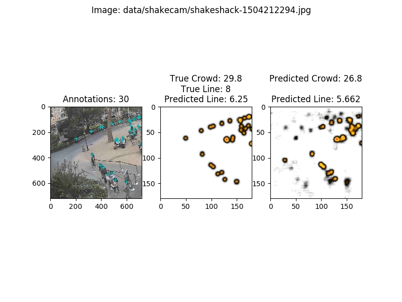

# Headcount
Counting the number of people in given image of crowd.
 
## Setup

 

1. Setup the virtualenv using the environment.yml file.
 
2.use manage.py file to list the commands.
<code>manage.py --help</code>  
 
3.To Train the model for dataset at ./data/{datast_folder_name}/{file_name}
<code> manage.py train_linecount</code>
 
4.To predict the model for dataset at $path_o_img
<code> manage.py predict --image $path_to_img --save</code>
the save file can be seen at ./predictor/ folder

 
 

### training

  
### sample on predction

